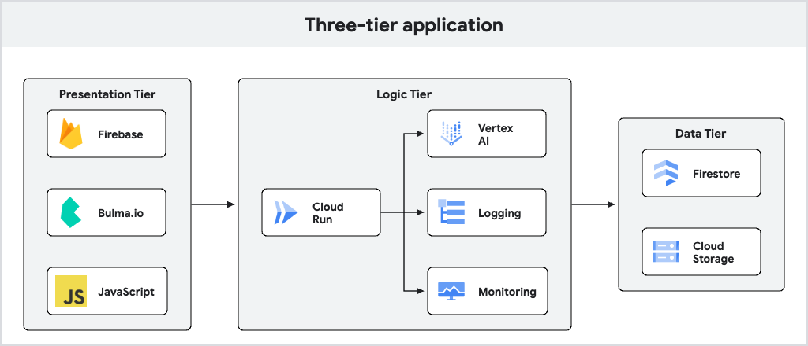

# My Herodotus

[Herodotus][herodotus], often considered the "Father of Historians," was also a prolific
travel journelist. His _Histories_ act as one of the very first travel guides of the
Ancient Mediterranean.

This project demonstrates how to create your own travel guide using generative AI
hosted on [Google Cloud][gcp]--in effect, your very own Herodotus.

## Architecture

This project uses a [three-tier architecture][three-tier], with a simple web
frontend, an application tier, and a data tier.

This project uses the following Google services:

+ [Vertex AI][vertex]
+ [Firestore][firestore]
+ [Cloud Run][run]
+ [Firebase authentication][firebase]

This project also uses the following libraries:

+ [Bulma][bulma]
+ [Gin][gin]

[bulma]: https://bulma.io/documentation/components/message/
[firebase]: https://firebase.google.com/docs/auth/web/password-auth
[firestore]: https://cloud.google.com/firestore/docs/samples/firestore-data-query#firestore_data_query-go
[gcp]: https://cloud.google.com
[gin]: https://github.com/gin-gonic/gin
[herodotus]: https://en.wikipedia.org/wiki/Herodotus
[run]: https://cloud.google.com/run/docs/overview/what-is-cloud-run
[three-tier]: https://www.ibm.com/topics/three-tier-architecture
[vertex]: https://cloud.google.com/vertex-ai/docs
