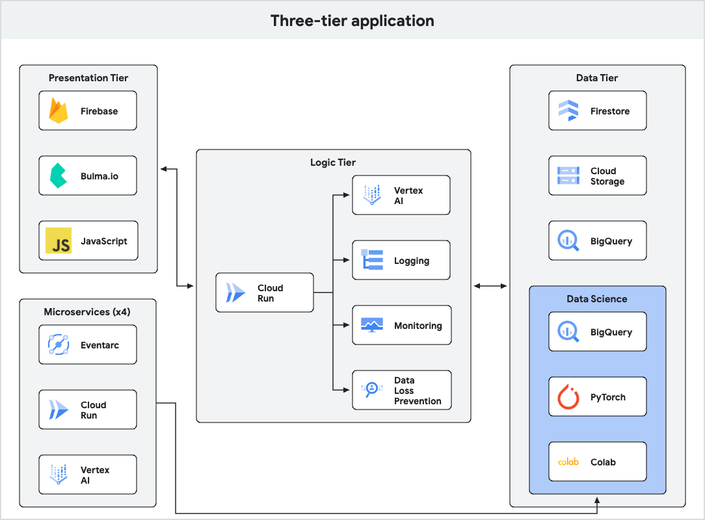

# My Herodotus

[Herodotus][herodotus], often considered the "Father of Historians," was also a prolific
travel journelist. His _Histories_ act as one of the very first travel guides of the
Ancient Mediterranean.

This project demonstrates how to create your own travel guide using generative AI
hosted on [Google Cloud][gcp]--in effect, your very own Herodotus.

## Architecture

This project uses a [three-tier architecture][three-tier], with a simple web
frontend, an application tier, and a data tier.

This project uses the following Google services:

+ [Vertex AI][vertex]
+ [Firestore][firestore]
+ [Cloud Run][run]
+ [Firebase authentication][firebase]
+ [BigQuery][bigquery]
+ [Colab/Vertex Workbenc][colab]

This project also uses the following libraries:

+ [Bulma][bulma]
+ [Gin][gin]
+ [PyTorch][pytorch]

## Model evaluations

This system allows the usage of three related LLM models:

+ The out-of-the-box [Gemini 1.5 Flash model][gemini]
+ A tuned version of the Gemini 1.5 Flash model, trained on the [Guanaco dataset][guanaco].
+ A [Gemma 2][gemma2] open source model.

These models have been evaluated against the following set of metrics.

+ [ROUGE][rouge]
+ [Closed domain][closed-domain]
+ [Open domain][closed-domain]
+ [Groundedness][groundedness]
+ [Coherence][coherence]

The following table shows the evaluation scores for each of these models.

| Model            | ROUGE  | Closed domain | Open domain | Groundedness | Coherence | Date of eval |
| ---------------- | ------ | ------------- | ----------- | ------------ | --------- | ------------ |
| Gemini 1.5 Flash | 0.20[1]| 0.0           | 1.0         | 1.0[1]       | 3.3       | 2024-11-25   |
| Tuned Gemini     | 0.21   | 0.4           | 1.0         | 1.0          | 2.4       | 2024-11-25   |
| Gemma            | 0.05   | 0.6           | 0.4         | 0.8          | 1.4       | 2024-11-25   |

[1]: Gemini 1.5 Flash responses from 2024-11-05 are used as the ground truth
for all other models.

## Adversarial evaluations

These models have been evaluated against the following set of adversarial
techniques.

+ [Prompt injection][injection]
+ [Prompt leaking][leaking]
+ [Jailbreaking][jailbreaking]

The following table shows the evaluation scores for adversarial prompting.

| Model            | Prompt injection  | Prompt leaking | Jailbreaking | Date of eval |
| ---------------- | ----------------- | -------------- | ------------ | ------------ |
| Gemini 1.5 Flash | 0.66              | 0.66           | 1.0          | 2024-11-25   |
| Tuned Gemini     | 0.33              | 1.0            | 1.0          | 2024-11-25   |
| Gemma            | 1.0               | 0.66           | 0.66         | 2024-11-25   |

[bigquery]: https://cloud.google.com/bigquery/docs
[bulma]: https://bulma.io/documentation/components/message/
[closed-domain]: https://www.promptingguide.ai/prompts/question-answering/closed-domain
[closed-domain]: https://www.promptingguide.ai/prompts/question-answering/open-domain
[coherence]: https://cloud.google.com/vertex-ai/generative-ai/docs/models/metrics-templates#pointwise_coherence
[colab]: https://cloud.google.com/colab/docs
[firebase]: https://firebase.google.com/docs/auth/web/password-auth
[firestore]: https://cloud.google.com/firestore/docs/samples/firestore-data-query#firestore_data_query-go
[gemini]: https://cloud.google.com/vertex-ai/generative-ai/docs/learn/models
[gemma2]: https://cloud.google.com/vertex-ai/generative-ai/docs/open-models/use-gemma
[gcp]: https://cloud.google.com
[gin]: https://github.com/gin-gonic/gin
[groundedness]: https://cloud.google.com/vertex-ai/generative-ai/docs/models/metrics-templates#pointwise_groundedness
[guanaco]: https://huggingface.co/datasets/timdettmers/openassistant-guanaco
[herodotus]: https://en.wikipedia.org/wiki/Herodotus
[injection]: https://www.promptingguide.ai/prompts/adversarial-prompting/prompt-injection
[jailbreaking]: https://www.promptingguide.ai/prompts/adversarial-prompting/jailbreaking-llms
[leaking]: https://www.promptingguide.ai/prompts/adversarial-prompting/prompt-leaking
[pytorch]: https://pytorch.org/
[rouge]: https://cloud.google.com/vertex-ai/generative-ai/docs/models/determine-eval#rouge
[run]: https://cloud.google.com/run/docs/overview/what-is-cloud-run
[three-tier]: https://www.ibm.com/topics/three-tier-architecture
[vertex]: https://cloud.google.com/vertex-ai/docs
